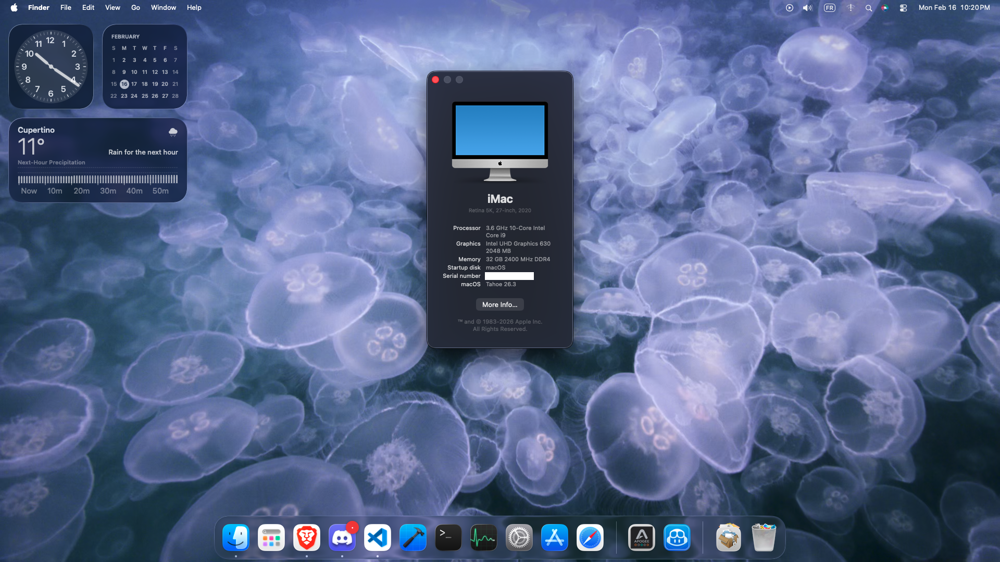

# OpenCore Asus Proart Z490 Creator 10G 

Using macOS Tahoe 26.3, OpenCore 1.0.6



## Hardware
- CPU: Intel i9-10850k
- Motherboard: ASUS ProArt Z490-CREATOR 10G
	- 2.5Gbit Ethernet: Intel I225-V
	- Audio: Realtek S1220A 8-Channel (ALC1220)
    - Thunderbolt 3
- RAM: 32GB 2400Mhz DDR4
- GPU:
    - Intel Graphics UHD 630
    - RTX 2070
- Audio:
    - Duet 2 by Apogee
    - Bowers & Wilkins speakers
- Ethernet: Marvell 10G LAN (Aquantia AQtion AQC107)
- Storage: Crucial P3 Plus 4.0 NVMe PCIe M.2, Crucial MX300 SATA SSD, Crucial Mx100 512GB 2.5" SSD, Crucial Bx200 960GB 2.5" SSD
- Bluetooth: TP-Link UB400

## Working
- [x] **Audio**: 
    - Duet 2 by Apogee with/without driver
    - Bowers & Wilkins speakers without driver
    - Realtek S1220A 8-Channel: **you need to manually install [VoodooHDA](#no-sound-with-macos-tahoe-260-and-later) for macOS 26 or later**
- [x] **USB**: mapped some ports USB 2.0 and USB 3.0, not USB C port
    - You will need to remap your USB ports
    - Remap using https://github.com/USBToolBox/tool
- [x] **Ethernet**: 
    - 2.5Gbit Ethernet (Intel I225-V)
    - 10Gbit Ethernet (Aquantia AQtion AQC107)
- [x] **Sleep/Wake**: using iGPU only
- [x] **Shutdown/Restart**: fixed BIOS reset or sent into Safemode after reboot/shutdown
- [x] **Bluetooth**: USB Bluetooth dongle TP-Link UB400
- [x] **Updates**: From Sequoia 15.5 to Tahoe 26.2
- [x] **Apple Secure Boot**: 
    - ApECID is generated
    - `nvram 94b73556-2197-4702-82a8-3e1337dafbfb:AppleSecureBootPolicy` returns `%02`

## Not working/not tested
- [ ] RTX 2070
- [ ] Thunderbolt (not tested)
- [ ] DRM
- [ ] iMessage (not tested)

## Warning
- I'm using RELEASE opencore build, thus:
    - Verbose is disabled
    - `TargetMisc -> Debug -> Target` is `3`
- To use DEBUG build:
    - Replace the following files with the [DEBUG version](https://github.com/acidanthera/OpenCorePkg/releases):
        - `EFI/BOOT/BOOTx64.efi`
        - `EFI/OC/Drivers/OpenRuntime.efi`
        - `EFI/OC/OpenCore.efi`
- You need to set `SecureBootModel` to `Disabled` to complete the installation to avoid bootloop ([see this](https://www.reddit.com/r/hackintosh/comments/1cdvijs/opencore_bootloader_menu_keeps_bootlooping_to/))
- Monitor is working with HDMI only of your motherboard
- You need to generate your [platform info](https://dortania.github.io/OpenCore-Install-Guide/config.plist/comet-lake.html#platforminfo):
    - Use Windows to get Apple ROM
- `IntelBluetoothFirmware.kext` is modified to work with some USB dongle ([see this](https://www.reddit.com/r/hackintosh/comments/16w2elb/how_to_make_generic_usb_bluetooth_50_csr_dongle/)):
    - You need to get your Vendor ID and Product ID of your Bluetooth dongle if it is not 0x0A12 and 0x0001 respectively and modify `IntelBluetoothFirmware.kext/Contents/Info.plist`
- `VT-d` must be enabled in BIOS, otherwise 10Gbit Ethernet (Aquantia AQtion AQC107) will not work 
- If you have a crash (kernel panic) a few seconds or minutes after booting, modify `Primary Display` to `CPU Graphics` in BIOS settings
- Since macOS Tahoe, Apple has changed the audio driver requirements. You may need to manually install [VoodooHDA](#no-sound-with-macos-tahoe-260-and-later) to get audio working
- For Apogee users, since macOS 26.0, you must use the following driver: `./Resources/Drivers/Apogee Control 2 Native_1_21_41.dmg`. And since macOS 26.3, you must disconnect and reconnect the Duet 2 after booting.

## Installation problems

### Booting into macOS Recovery automatically
- You need to generate your own ApECID ([see this](https://dortania.github.io/OpenCore-Post-Install/universal/security/applesecureboot.html#apecid))
- Personalize your macOS installation in **macOS Recovery**:
    ```bash
    # You'll also need an active network connection in recovery to run this command
    # Replace "Macintosh HD" with your macOS disk name
    bless --folder "/Volumes/Macintosh HD/System/Library/CoreServices" --bootefi --personalize
    ```

### Failed to prepare the software update
If you have `Failed to prepare the software update` error:
- Try again a second time, it will download the complete update instead of the delta update, and it will work without any problem
- Use Terminal:
    ```bash
    sudo softwareupdate -i -a -R
    ```

If you still can't install the update: (normally fixed with [iBridged](https://github.com/Carnations-Botanica/iBridged))
- Verify that `SecureBootModel` is set to `Disabled` 
- Reset NVRAM 
- Do the update
- Personalize your macOS installation in macOS Recovery (see [Booting into macOS Recovery automatically section](#booting-into-macos-recovery-automatically))
- Don't forget to change `SecureBootModel` back to `j185f` after the update and reset NVRAM again

### No sound with macOS Tahoe 26.0 and later
- Reset NVRAM
- Reboot
- Download [VoodooHDA.kext](https://github.com/CloverHackyColor/VoodooHDA/releases/download/Release303/VoodooHDA.kext-303.zip)
- Download [VoodooHDA.prefPane](https://github.com/CloverHackyColor/VoodooHDA/releases/download/Release302/VoodooHDA.prefPane.zip)
- Unzip both files
- Use terminal to install VoodooHDA:
    ```bash
    sudo cp -R /path_to/VoodooHDA.kext /Library/Extensions/
    sudo cp -R /path_to/VoodooHDA.prefPane /Library/PreferencePanes/
    ```
- Wait while the system saids that the kext must be approved
- Go to System Settings and approve the kext.
- Reboot

## Dual boot with different disks
- If you already have EFI partition:
    - Mount the macOS disk EFI partition
    - Copy `EFI` folder to the macOS disk EFI partition 
- If you don't have EFI partition without wiping (using macOS __installer__):
    - Type `diskutil list` to find the macOS disk number
    - Resize the APFS partition to create a new partition for EFI:
        ```bash
        diskutil apfs resizeContainer diskXsY 274.6GB
        ```
    - Force unmount the disk:
        ```bash
        diskutil unmountDisk force /dev/diskX
        ```
    - Create a new partition for EFI:
        ```bash
        gpt add -i [new partition number] -b $(gpt show diskX | grep free | awk '{print $1}') -s $(echo "200*1024*1024/512" | bc) -t C12A7328-F81F-11D2-BA4B-00A0C93EC93B /dev/diskX
        ```
    - Copy `EFI` folder to the macOS disk EFI partition (using macOS)

## Other drivers
Available in `./Resources/Drivers`:
- `duet-2.5c.zip`: for Duet 2 by Apogee
- `Apogee Control 2 Native_1_21_41.dmg`: Apogee Control 2 driver by Apogee, compatible with macOS Tahoe

## Sources
- OpenCore Install Guide: https://dortania.github.io/OpenCore-Install-Guide
- Existing configuration Z490 (fix iGPU): https://github.com/xiaovie/Hackintosh-ROG-Z490-series-motherboard-OpenCore
- Bluetooth dongle fix: https://www.reddit.com/r/hackintosh/comments/16w2elb/how_to_make_generic_usb_bluetooth_50_csr_dongle/
- Fix for bootloop in installer: https://www.reddit.com/r/hackintosh/comments/1cdvijs/opencore_bootloader_menu_keeps_bootlooping_to/
- USB remap: https://github.com/USBToolBox/tool
- Check Apple Secure Boot: https://github.com/perez987/Apple-Secure-Boot-and-Vault-with-OpenCore
- VoodooHDA: https://github.com/CloverHackyColor/VoodooHDA